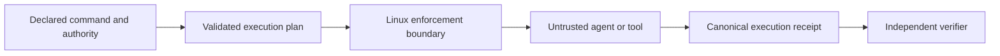

# Proofbound Runtime

Run untrusted tools with declared authority and produce an independently
verifiable account of the execution boundary.

> **Status:** foundation implementation. The repository contains the first
> typed authority-normalization core and its Tier 0 through Tier 2 assurance
> evidence. It does not yet provide an executable runtime or containment
> guarantee.

## What it is

Proofbound Runtime is a Linux-first execution-assurance gateway for autonomous
agents and other untrusted tools. A caller declares the command, inputs,
environment, executable closure, filesystem access, network mode, and resource
limits for one execution. The runtime installs the requested operating-system
boundary before child code starts and emits a canonical execution receipt.

The intended initial boundary uses:

- Landlock for filesystem authority;
- seccomp with `no_new_privs` for syscall restrictions;
- cgroup v2 for process and resource limits;
- an explicit environment allow-list;
- an exact executable and loader closure; and
- fresh output roots with bounded process streams.

Proofbound Runtime is not an operating-system kernel, container runtime, or
virtual machine. It is a gateway that uses kernel-enforced mechanisms.

## What a receipt means

A valid receipt identifies the execution plan, compiled policy, platform,
runtime, inputs, outputs, enforcement mechanism, and outcome for one run. It
does not prove that Linux is correct or that every possible information leak is
absent.

The receipt producer records typed facts. A separately implemented verifier
derives validity and reuse eligibility. The producer cannot declare its own
receipt successful.



## Relationship to Proofbound

[Proofbound](https://github.com/bordumb/proof-bound) is the assurance compiler
used to develop and release this product. It owns claim status, evidence
meaning, assumptions, artifact linkage, and generic receipt composition.

Proofbound Runtime owns agent execution plans, authority semantics, Linux
policy compilation, boundary installation, run observations, and execution
receipts. Proofbound does not run in the child security path.

Runtime discoveries that require generic Proofbound support are recorded in
[`docs/proofbound-feedback`](docs/proofbound-feedback/README.md) before they are
deliberately upstreamed.

## Development approach

The project uses Proof-Driven Development:

1. Register the complete product claim map at Proofbound Tier 0.
2. Take one small foundational claim through Tier 3 before expanding the
   architecture.
3. Develop later behavior in claim-sized assurance waves.
4. Refactor when stronger evidence exposes a weak abstraction or missing
   linkage.
5. Rebuild every affected evidence path after source or artifact changes.

The first walking-skeleton claim is `PBR-AUTH-001`: authority normalization does
not amplify authority.

## Repository checks

Install the pinned Rust and Lean toolchains, `just`, `cargo-deny`, Kani 0.67.0,
and the pinned `proofbound` revision. Then run:

```console
just ci
```

The current CI checks documentation, project metadata, the Rust workspace,
independent authority conformance, dependency policy, the Lean model, the
bounded Kani domain, and Proofbound Tier 2 status derivation. Source refinement,
artifact binding, and native Linux enforcement remain open.

## Documentation

- [Documentation map](docs/README.md)
- [Initial specification](docs/specs/0001_initial_spec.md)
- [Threat model](docs/threat-model.md)
- [Architecture decisions](docs/adr/README.md)
- [Proofbound feedback loop](docs/proofbound-feedback/README.md)
- [Contributor and agent rules](AGENTS.md)

## Supported platforms

No platform is supported while the product remains pre-implementation. The
first intended target is native Linux on `x86_64` and `aarch64` with the exact
Landlock, seccomp, and cgroup capabilities required by the selected profile.
Unsupported capability will fail closed. A container or mock will not count as
native enforcement evidence.

## License

Proofbound Runtime is available under the [MIT License](LICENSE).
