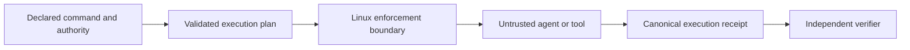

# Proofbound Runtime

Run untrusted tools with declared authority and produce an independently
verifiable account of the execution boundary.

> **Status:** 0.1.0 release candidate. The executable product surface and
> native Linux boundary are implemented and exercised on `x86_64` and
> `aarch64`. Exact release-artifact binding and the independently verified
> Proofbound release receipt remain open, so no 0.1.0 release has been
> published yet.

## What it is

Proofbound Runtime is a Linux-first execution-assurance gateway for autonomous
agents and other untrusted tools. A caller declares the command, inputs,
environment, executable closure, filesystem access, network mode, and resource
limits for one execution. The runtime installs the requested operating-system
boundary before child code starts and emits a canonical execution receipt.

The intended initial boundary uses:

- Landlock for filesystem authority;
- seccomp with `no_new_privs` for syscall restrictions;
- cgroup v2 for process and resource limits;
- an explicit environment allow-list;
- an exact executable and loader closure; and
- fresh output roots with bounded process streams.

Proofbound Runtime is not an operating-system kernel, container runtime, or
virtual machine. It is a gateway that uses kernel-enforced mechanisms.

## What a receipt means

A valid receipt identifies the execution plan, compiled policy, platform,
runtime, inputs, outputs, enforcement mechanism, and outcome for one run. It
does not prove that Linux is correct or that every possible information leak is
absent.

The receipt producer records typed facts. A separately implemented verifier
derives validity and reuse eligibility. The producer cannot declare its own
receipt successful.



## Relationship to Proofbound

[Proofbound](https://github.com/bordumb/proof-bound) is the assurance compiler
used to develop and release this product. It owns claim status, evidence
meaning, assumptions, artifact linkage, and generic receipt composition.

Proofbound Runtime owns agent execution plans, authority semantics, Linux
policy compilation, boundary installation, run observations, and execution
receipts. Proofbound does not run in the child security path.

Runtime discoveries that require generic Proofbound support are recorded in
[`docs/proofbound-feedback`](docs/proofbound-feedback/README.md) before they are
deliberately upstreamed.

## Development approach

The project uses Proof-Driven Development:

1. Register the complete product claim map at Proofbound Tier 0.
2. Take one small foundational claim through Tier 3 before expanding the
   architecture.
3. Develop later behavior in claim-sized assurance waves.
4. Refactor when stronger evidence exposes a weak abstraction or missing
   linkage.
5. Rebuild every affected evidence path after source or artifact changes.

The first two completed source-linkage waves are `PBR-AUTH-001`, authority
normalization does not amplify authority, and `PBR-RECEIPT-004`, incomplete
executions are not reusable. Both still require release-artifact binding before
their statements can apply to shipping binaries.

## Quick start

Build the three colocated binaries on a supported native Linux host:

```console
cargo build --locked --release --bins
target/release/pbr --version
target/release/pbr-verify --version
```

The host must provide a delegated cgroup v2 directory with the `pids`
controller enabled and no direct processes. Confirm all required mechanisms
before running a workload:

```console
target/release/pbr doctor --cgroup-root /path/to/delegated/cgroup
```

Create a plan beside an existing statically linked executable. Replace the
absolute executable path below, and make sure `output/` and `receipt.json` do
not already exist:

```toml
schema = "proofbound-runtime-plan/1"
id = "example.hello"

[command]
executable = "/absolute/path/to/static-tool"
arguments = []
working_directory = "."

[authority]
network = "deny"
environment = []
read = []
runtime_read = []
write = ["output"]
execute = ["/absolute/path/to/static-tool"]

[limits]
wall_time_ms = 5000
stdout_bytes = 65536
stderr_bytes = 65536
processes = 1
```

Validate, execute, independently verify, and inspect it:

```console
target/release/pbr plan check --plan plan.toml
target/release/pbr run --plan plan.toml --receipt receipt.json \
  --cgroup-root /path/to/delegated/cgroup >run-result.json
COMMITMENT=$(python3 -c \
  'import json; print(json.load(open("run-result.json"))["commitment"])')
target/release/pbr-verify --expected-commitment "$COMMITMENT" receipt.json
target/release/pbr inspect receipt.json
```

`runtime_read` must explicitly list canonical absolute library roots for a
dynamically linked workload. Those roots are measured authority, not an
implicit convenience. `tools/ci/native-linux.sh` is the maintained reference
for creating a delegated test boundary with systemd.

## Repository checks

Install the pinned Rust and Lean toolchains, `just`, `cargo-deny`, Kani 0.67.0,
and the pinned `proofbound` revision. Then run:

```console
just ci
```

The current CI checks documentation, project metadata, the Rust workspace,
independent conformance, dependency policy, Lean 4.33 models,
source-refinement bridges, bounded Kani domains, Proofbound status derivation,
and native Linux enforcement. The release workflow builds each architecture
twice and rejects byte drift before it executes the exact release binaries.

## Documentation

- [Documentation map](docs/README.md)
- [Initial specification](docs/specs/0001_initial_spec.md)
- [Version 1 CLI specification](docs/specs/0002_cli_surface.md)
- [Threat model](docs/threat-model.md)
- [Architecture decisions](docs/adr/README.md)
- [Proofbound feedback loop](docs/proofbound-feedback/README.md)
- [Contributor and agent rules](AGENTS.md)

## Supported platforms

Version 0.1 targets native Linux on `x86_64` and `aarch64`. A supported host is
non-root, exposes the reviewed Landlock ABI range 3 through 11, supports
`no_new_privs` and the registered seccomp actions, and supplies a delegated
cgroup v2 root with the `pids` controller enabled. `pbr doctor` reports the
observed capability identity. Any missing, older, newer, mismatched, or
unreviewed mechanism fails closed; macOS and Windows can validate plans and
inspect receipts but cannot execute them. A container or mock does not count as
native enforcement evidence.

## License

Proofbound Runtime is available under the [MIT License](LICENSE).
