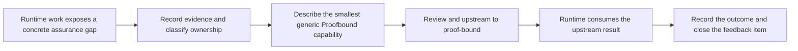

# Proofbound feedback

This directory records requirements that Proofbound Runtime discovers for the
Proofbound framework.

The directory creates a deliberate feedback loop:



It is not a replacement for Proofbound specifications, ADRs, issues, or claim
manifests. A feedback item explains why upstream work is needed and preserves
the evidence that led to it. After Proofbound accepts or rejects the proposal,
the upstream record becomes authoritative.

## What belongs here

Create a feedback item when runtime work exposes a generic Proofbound need such
as:

- a missing subject type for deployment or execution;
- a missing evidence family or status-preserving composition rule;
- a schema that cannot represent a required assumption, identity, or bound;
- a verifier rule needed to reject omission, downgrade, replay, or
  substitution;
- a plugin boundary that cannot represent domain evidence without adding domain
  semantics to framework core; or
- a developer workflow that causes assurance meaning to drift.

The item MUST start from a concrete runtime observation. Do not create a
feedback item only because an idea might be useful later.

## What does not belong here

Do not use this directory for:

- Linux launcher implementation details;
- Landlock, seccomp, or cgroup policy specific to this product;
- agent product features;
- runtime bugs that do not expose a framework defect;
- informal brainstorming without a concrete observation;
- copies of Proofbound specifications; or
- requests that would let runtime evidence manufacture stronger status.

Put runtime-specific architecture decisions in `docs/adr/`. Put normative
runtime behavior in `docs/specs/`. Put implementation work in the applicable
crate or issue tracker.

## File organization

Keep this directory flat. Do not move files when their status changes. Stable
paths make reviews and upstream references durable.

Use this filename format:

```text
pbf-NNNN-short-kebab-title.md
```

For example:

```text
pbf-0001-execution-subjects.md
```

Use the next unused four-digit number. Never reuse an ID, including after an
item is rejected or superseded. Copy `TEMPLATE.md` to create the file.

Each item describes one capability or decision. Split a proposal when its parts
can be accepted, rejected, or implemented independently.

## Lifecycle

Each item has one status:

| Status | Meaning |
| --- | --- |
| `observed` | A concrete runtime need exists, but the generic shape is not settled. |
| `proposed` | The item states a generic Proofbound change and its assurance constraints. |
| `upstream-ready` | The item has evidence, acceptance criteria, and no unresolved ownership question. |
| `upstreamed` | An exact Proofbound issue, specification, ADR, commit, or pull request carries the proposal. |
| `resolved` | Proofbound accepted, implemented, rejected, or deliberately deferred the proposal. |
| `superseded` | Another feedback item or upstream decision replaced this item. |

Status is descriptive. It does not imply that the proposal is correct or that
Proofbound has accepted it.

Use one priority:

| Priority | Meaning |
| --- | --- |
| `blocking` | A runtime claim or milestone cannot progress honestly without the change. |
| `near-term` | A safe local boundary exists, but the gap blocks composition or reuse. |
| `later` | The observation is concrete and useful, but no current milestone depends on it. |

Use one kind:

- `subject-model`;
- `evidence-semantics`;
- `schema`;
- `verifier`;
- `plugin-boundary`;
- `workflow`; or
- `documentation`.

## Required contents

Every feedback item MUST contain:

1. **Runtime observation** — the exact behavior, failing case, or blocked claim
   that exposed the gap.
2. **Ownership test** — why the requirement is generic Proofbound behavior and
   not runtime-domain semantics.
3. **Assurance risk** — what could be overstated, omitted, downgraded, or made
   unverifiable if the gap remains.
4. **Proposed upstream behavior** — the smallest generic behavior needed from
   Proofbound.
5. **Evidence meaning** — what the new record can establish and what it cannot
   establish.
6. **Acceptance criteria** — exact positive and adversarial behavior that would
   show the upstream capability works.
7. **Local treatment** — the fail-closed workaround or the milestone that stays
   blocked before upstream resolution.
8. **Upstream handoff** — exact links or repository paths after upstream work
   begins.
9. **Resolution** — what Proofbound decided and how Runtime consumed it.

Use exact repository paths, claim IDs, schema versions, receipt identities, and
test names when they exist. Do not use a green build, exit code, or percentage
as the evidence for the observation.

## Workflow

### 1. Observe

Start from runtime work. Reduce the problem to the smallest reproducible
example. Record the affected claim and milestone.

### 2. Classify ownership

Ask whether a second unrelated Proofbound consumer could need the same semantic
capability. If not, keep the behavior in Proofbound Runtime. A reusable data
structure alone is not sufficient reason to place domain semantics in framework
core.

### 3. Draft

Copy `TEMPLATE.md`, assign the next ID, and set the status to `observed`. State
facts before proposing a solution. Record unknowns as unknowns.

### 4. Review locally

Confirm that the proposal:

- preserves Proofbound's evidence distinctions;
- cannot upgrade tests, bounded checks, model theorems, or identities;
- retains all assumptions, bounds, and trusted-computing-base roles;
- gives the independent verifier enough information to re-derive the result;
- contains no runtime-specific policy in Proofbound core; and
- fails closed when data or capability is missing.

Move the item to `upstream-ready` only after it has exact acceptance criteria.

### 5. Upstream deliberately

Upstream work requires an explicit task. Do not edit the sibling `proof-bound`
repository merely because a feedback item exists.

Choose the appropriate Proofbound destination:

| Change | Upstream destination |
| --- | --- |
| Exploratory product direction | `docs/notes/` |
| Normative graph or wire behavior | `docs/specs/` |
| Trust-boundary or architecture decision | `docs/adr/` |
| Concrete implementation defect | Issue, test, and implementation change |
| New generic integration | External plugin first; core only after demonstrated reuse |

Record the exact destination and change the item status to `upstreamed`.

### 6. Close the loop

When Proofbound reaches a decision, record:

- the accepted, rejected, or revised behavior;
- the exact upstream identity;
- any migration needed in Runtime;
- the Runtime claim or milestone that became unblocked; and
- the evidence that Runtime consumes.

Set the status to `resolved` or `superseded`. Do not delete the record. Its
history explains why the cross-repository boundary changed.

## Index

Add each new feedback item to this table. Sort active items by ID. Keep resolved
and superseded items in the table.

| ID | Title | Kind | Priority | Status | Runtime milestone | Upstream record |
| --- | --- | --- | --- | --- | --- | --- |
| [PBF-0001](pbf-0001-aeneas-standard-library-bridges.md) | Reusable Aeneas standard-library bridges | `plugin-boundary` | `near-term` | `proposed` | Milestone 1 | Not upstreamed |
| [PBF-0002](pbf-0002-lean-theorem-identity-update.md) | Lean theorem identity update | `workflow` | `near-term` | `proposed` | Milestone 1 | Not upstreamed |
| [PBF-0003](pbf-0003-missing-adapter-diagnostics.md) | Missing adapter diagnostics | `workflow` | `near-term` | `proposed` | Milestone 1 | Not upstreamed |
| [PBF-0004](pbf-0004-lean-toolchain-isolation.md) | Lean toolchain isolation for theorem evidence | `workflow` | `later` | `resolved` | Milestone 1 | Deliberately deferred |
| [PBF-0005](pbf-0005-source-refinement-premise-edges.md) | Source-refinement premise edges | `evidence-semantics` | `blocking` | `resolved` | Milestone 1 | `proof-bound@d6ed79d` |
| [PBF-0006](pbf-0006-typed-premise-discharge-joins.md) | Typed premise discharge joins | `evidence-semantics` | `blocking` | `resolved` | Milestone 1 | `proof-bound@504d17d` |
| [PBF-0007](pbf-0007-claim-evidence-domain-consistency.md) | Claim/evidence bounded-domain consistency | `verifier` | `near-term` | `upstream-ready` | Policy compilation | Not upstreamed |
| [PBF-0008](pbf-0008-tested-release-artifact-observations.md) | Tested release-artifact observations | `evidence-semantics` | `blocking` | `resolved` | Version 0.1 release linkage | `proof-bound` ADR 0020; `dd5893d..cf8f2ba` |
| [PBF-0009](pbf-0009-reviewed-release-evidence-contexts.md) | Reviewed release evidence contexts | `workflow` | `blocking` | `resolved` | Version 0.1 release linkage | `proof-bound` ADR 0021; `23065d2..65b4698` |
| [PBF-0010](pbf-0010-translation-cache-state-exclusion.md) | Translation cache state exclusion | `workflow` | `blocking` | `resolved` | Version 0.1 release linkage | `proof-bound@585c0e0` |
| [PBF-0011](pbf-0011-contextual-semantic-artifact-binding.md) | Contextual semantic artifact binding | `evidence-semantics` | `blocking` | `upstream-ready` | Version 0.1 release linkage | Not upstreamed |

## Rules for agents

Agents working in this repository MUST:

- read this file before creating or changing feedback;
- start from `TEMPLATE.md`;
- use the next unused stable ID;
- update the index in the same change;
- preserve concrete evidence and unresolved uncertainty;
- avoid editing Proofbound without explicit authorization; and
- update the local item after authorized upstream work so the loop closes.
