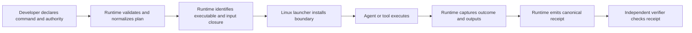

# Specification 0001: Proofbound Runtime

**Status:** Initial implementation specification

**Version:** 0.1.0

**Date:** 2026-09-04

**Project:** Proofbound Runtime

**Process:** Proof-Driven Development (PDD)

## 1. Executive summary

Proofbound Runtime is a Linux-first execution-assurance gateway for autonomous
agents and other untrusted tools. It runs a command with declared authority,
installs an operating-system boundary before the command starts, and emits a
canonical receipt that records the exact execution plan, enforcement mechanism,
subject identities, outcome, and outputs.

The first release uses Linux Landlock for filesystem restrictions, seccomp with
`no_new_privs` for syscall restrictions, and cgroup v2 for process limits. It
denies undeclared authority. It does not ask the child process to report whether
it obeyed the policy.

Proofbound Runtime is not an operating-system kernel. It is a gateway that uses
kernel-enforced mechanisms. It is also not part of Proofbound core. Proofbound
Runtime is a separate product that uses Proofbound to develop and release its
own assurance claims.

The product answers a narrow question:

> What authority did this execution receive, which boundary enforced it, and
> what exact result did the execution produce?

It does not claim to prove the absence of every possible information leak. A
receipt is evidence about one identified execution under one identified Linux
boundary. Any claim derived from the receipt MUST retain the applicable kernel,
hardware, launcher, runtime, and threat-model assumptions.

## 2. Product principles

Proofbound Runtime MUST follow these principles:

1. **Authority is explicit.** The execution plan lists each allowed effect.
2. **Authority only gets smaller.** Normalization and compilation MUST NOT add
   authority that the input policy did not contain.
3. **Enforcement precedes execution.** User code MUST NOT start before all
   required restrictions are active.
4. **Unsupported means unavailable.** The runtime MUST NOT fall back to an
   unconfined or weaker execution mode.
5. **Identity is exact.** Receipts bind relevant files, executables, loaders,
   policies, inputs, outputs, tools, and platform details.
6. **Failure does not become evidence.** A denied, incomplete, timed-out, or
   malformed execution MUST NOT produce a reusable success receipt.
7. **Receipts do not grade themselves.** The producer records typed facts. A
   separate verifier derives whether the receipt is valid and reusable.
8. **Evidence keeps its meaning.** Tests remain tests. Bounded checks remain
   bounded. A model theorem remains model-only until registered linkage connects
   it to the shipping implementation.
9. **Secrets are not evidence.** Receipts MUST NOT include secret values merely
   to make an execution reproducible.
10. **The smallest trusted boundary wins.** Pure decisions stay separate from
    effectful Linux operations.

## 3. Goals and non-goals

### 3.1 Goals

The initial implementation MUST:

- accept a strict, versioned execution plan;
- validate and normalize a deny-by-default authority policy;
- resolve the exact executable and dynamic-loader closure needed for the run;
- identify all security-relevant inputs before execution;
- install `no_new_privs`, Landlock, and seccomp before `execve`;
- restrict filesystem reads, writes, and executable files;
- deny network syscalls in the initial profile;
- pass only registered environment variables to the child;
- use a fresh output root for each execution;
- capture bounded standard output, standard error, exit status, and termination
  details;
- emit one canonical, versioned execution receipt;
- make incomplete and denied executions non-reusable;
- provide an independently implemented receipt verifier;
- support deterministic policy compilation and receipt derivation;
- fail closed on unsupported platforms, mechanisms, policy fields, identities,
  or receipt versions; and
- use Proofbound to track the evidence and assumptions behind each release.

### 3.2 Initial platform scope

Version 0.1 targets native Linux on `x86_64` and `aarch64`.

The host MUST provide:

- a Linux kernel with a supported Landlock ABI;
- `PR_SET_NO_NEW_PRIVS` support;
- the seccomp filtering features required by the selected profile;
- a delegated cgroup v2 subtree with the required controllers;
- a local filesystem with stable file identity during plan resolution and
  execution; and
- an unprivileged child process without ambient capabilities or set-user-ID
  transitions.

The initial profile permits no network access. A later version can add typed
network authority only after the project defines and tests a mechanism that does
not convert an address allow-list into a misleading claim about remote identity.

### 3.3 Non-goals

The initial implementation MUST NOT claim to:

- be an operating-system kernel, container runtime, virtual machine, or general
  workload orchestrator;
- protect against a malicious host administrator, host root, a compromised
  kernel, hostile firmware, or hostile hardware;
- prevent microarchitectural, timing, power, or other side channels;
- prove that Linux, Landlock, seccomp, a language runtime, or a dynamic loader is
  correct;
- infer a safe policy from an arbitrary command;
- permit a weaker fallback when the requested boundary is unavailable;
- treat denial probes as a universal proof of absence;
- treat a receipt digest as proof of program behavior;
- retain raw secret environment values, tokens, or credentials in a receipt;
- support macOS or Windows under the Linux assurance label;
- run a long-lived multi-tenant daemon in the first release; or
- add agent-specific semantics to Proofbound core.

## 4. User workflow

The initial product is a local command-line tool. It has no daemon and no
network service.



The normal workflow is:

1. The developer writes an execution plan.
2. `pbr plan check` validates the plan without running it.
3. `pbr run` resolves the plan and starts the command.
4. The launcher installs every required boundary before it calls `execve`.
5. The supervisor captures the exact outcome and output identities.
6. The runtime writes a canonical receipt.
7. `pbr-verify` independently validates the receipt.
8. Proofbound can consume the verified receipt as typed execution evidence when
   a compatible plugin exists.

### 4.1 Example execution plan

The user-facing plan format is TOML. The schema is closed and versioned.
Unknown fields are errors.

```toml
schema = "proofbound-runtime-plan/1"
id = "example.agent-format"

[command]
executable = "/usr/bin/python3"
arguments = ["tools/format.py"]
working_directory = "."

[authority]
network = "deny"
environment = ["LANG", "PATH"]
read = ["tools", "src", "pyproject.toml"]
write = [".proofbound-runtime/output"]
execute = ["/usr/bin/python3"]

[limits]
wall_time_ms = 30_000
stdout_bytes = 1_048_576
stderr_bytes = 1_048_576
processes = 16
```

Relative paths are resolved from the plan root. The runtime MUST reject paths
that escape the plan root unless the path has an explicit external role, such
as `runtime-executable` or `runtime-loader-executable`.

### 4.2 Command-line interface

The first public commands are:

| Command | Behavior |
| --- | --- |
| `pbr doctor` | Report platform and mechanism availability. It MUST NOT run a workload. |
| `pbr plan check --plan <path>` | Parse, validate, normalize, and explain a plan. It MUST NOT install a boundary or run the command. |
| `pbr run --plan <path> --receipt <path>` | Run the exact registered command and write one receipt. |
| `pbr inspect <receipt>` | Render the receipt for a person without changing its meaning. |
| `pbr-verify <receipt>` | Independently validate schema, identities, derivation, and reuse eligibility. |

The `run` command MUST NOT accept extra positional command arguments. This rule
prevents the command that runs from drifting away from the command that was
reviewed.

Machine-readable output uses JSON on standard output. Human diagnostics use
standard error. Stable error codes are part of the public contract.

### 4.3 Exit behavior

The CLI distinguishes runtime failure from child failure.

| Exit code class | Meaning |
| --- | --- |
| `0` | The requested runtime operation completed. For `run`, the receipt records the child outcome separately. |
| `2` | The user input or plan is invalid. |
| `3` | The requested platform boundary is unavailable or unsupported. |
| `4` | A security-relevant identity changed before execution. |
| `5` | Boundary installation or launcher sequencing failed. |
| `6` | Receipt construction or canonical encoding failed. |
| `7` | Independent receipt verification failed. |

Specific machine error codes MUST refine these classes. Code MUST NOT branch on
diagnostic text.

## 5. Domain model

The domain model uses closed types. Unvalidated strings MUST NOT cross into the
trusted decision core.

### 5.1 Primary types

| Type | Meaning |
| --- | --- |
| `PlanId` | A validated stable identifier for one execution plan. |
| `PlanVersion` | The closed plan schema version. |
| `ArtifactIdentity` | A digest algorithm, digest bytes, size, mode, and typed artifact role. |
| `ResolvedPath` | An absolute path resolved under an explicit root and role. |
| `AuthorityPlan` | The exact authority requested by the caller. |
| `NormalizedAuthority` | A canonical, deduplicated, no-more-permissive authority set. |
| `PlatformCapability` | One observed Linux enforcement capability and its exact version. |
| `CompiledPolicy` | Canonical Landlock, seccomp, and cgroup inputs derived from normalized authority. |
| `ExecutionId` | A fresh identifier for one execution attempt. |
| `ExecutionOutcome` | A closed result: exited, signaled, timed out, denied, or launcher failure. |
| `ReceiptEligibility` | A derived result: reusable or non-reusable with typed reasons. |
| `ExecutionReceipt` | The complete canonical account of one attempt. |

### 5.1.1 Receipt eligibility state model

Receipt eligibility is a total derivation over these closed input states:

| Input | Closed states |
| --- | --- |
| Boundary installation | `installed`, `incomplete` |
| Execution outcome | `exited(code)`, `signaled(signal)`, `timed-out`, `denied`, `launcher-failed`, `incomplete` |
| Standard-output capture | `complete`, `truncated` |
| Standard-error capture | `complete`, `truncated` |
| Receipt structure | `valid`, `malformed` |

A receipt is reusable if and only if all of these conditions hold:

1. boundary installation is `installed`;
2. the execution outcome is `exited(0)`;
3. both stream captures are `complete`; and
4. the receipt structure is `valid`.

Every other represented state is non-reusable. Derivation MUST retain every
applicable reason. It MUST order reasons as follows:

1. `boundary-incomplete`;
2. `exit-code-nonzero`;
3. `process-signaled`;
4. `timed-out`;
5. `denied`;
6. `launcher-failed`;
7. `execution-incomplete`;
8. `stdout-truncated`;
9. `stderr-truncated`; and
10. `receipt-malformed`.

The reusable state contains no non-reuse reasons. The non-reusable state
contains at least one reason. Unknown wire values do not enter this state
model. A decoder rejects them before derivation.

### 5.2 Authority model

Version 1 contains these authority classes:

- filesystem read;
- filesystem write;
- filesystem execute;
- environment-name access;
- process-count limit;
- wall-time limit;
- standard-output limit;
- standard-error limit; and
- network mode, fixed to `deny` in the initial release.

Each authority is additive only within the input plan. Policy normalization MAY
remove duplicates, reject overlaps, or reduce authority. It MUST NOT add a path,
environment name, executable, syscall class, or limit that the caller did not
request, except for a typed platform closure that the plan explicitly permits.

A platform closure contains the files that the registered executable and its
runtime need for the supported run. For an ELF program, this includes the exact
interpreter from `PT_INTERP`. A dynamic language can also need explicitly
registered read-only library roots. Every closure item MUST have a typed role
and an artifact identity. Directory-wide execute authority MUST NOT replace
exact executable and loader roles.

### 5.3 Secret inputs

The plan MAY refer to a secret by provider and opaque key. It MUST NOT contain a
secret value in committed configuration.

The runtime MAY pass a resolved secret to the child only when a future authority
profile explicitly supports that provider. The receipt records the environment
name, provider identity, and a non-secret version identity when available. It
MUST NOT record the secret value or a reversible representation of it.

Secret support is deferred from the first executable milestone. An unknown or
unsupported secret provider is an error, not an empty value.

## 6. Security architecture

### 6.1 Components


The pure domain core owns validation, normalization, identity rules, policy
meaning, and receipt eligibility. It performs no filesystem mutation, process
creation, clock access, environment access, or network access.

The Linux policy compiler converts normalized authority into a closed Landlock
ruleset, seccomp program, and cgroup limit set. Its strongest intended theorem
is:

> Policy compilation does not grant an authority that is absent from the
> normalized authority plan.

This theorem is conditional on the formal model and platform assumptions. It is
not a proof that the Linux kernel implements the model correctly.

The launcher owns the smallest possible effectful boundary. The supervisor
places it in a fresh cgroup before release. The launcher confirms required
features, installs `no_new_privs`, applies Landlock, installs seccomp, closes
undeclared file descriptors, and calls `execve`. If any step fails, it MUST stop
without starting user code.

### 6.2 Required sequencing

The supervisor and launcher MUST preserve this order:

1. The supervisor prepares standard streams and the fresh output root.
2. The supervisor creates a fresh cgroup and installs the registered limits.
3. The supervisor starts the launcher in a paused state and places it in the
   cgroup.
4. The launcher receives the validated policy through a private channel.
5. The launcher verifies the policy and cgroup identities.
6. The launcher closes undeclared file descriptors.
7. The launcher removes ambient privileges and sets `no_new_privs`.
8. The launcher installs the Landlock filesystem ruleset.
9. The launcher installs the seccomp filter.
10. The launcher emits a boundary-installed acknowledgement to the supervisor.
11. The launcher calls `execve` for the identified executable.

The supervisor MUST NOT treat process creation as proof that step 8 occurred.
The acknowledgement protocol MUST be typed and bound to the compiled policy
identity. EOF, malformed data, partial data, or a mismatched identity is a
launcher failure.

### 6.3 Filesystem safety

Path strings alone are not sufficient security identities. Resolution MUST:

- reject empty paths and embedded NUL bytes;
- normalize relative paths against a registered root;
- prevent `..` from escaping that root;
- detect symlink cycles;
- reject forbidden file kinds;
- retain the requested path and resolved target;
- identify the resolved object before execution; and
- detect identity drift before the launcher uses it.

Where Linux permits it, the implementation SHOULD use file descriptors and
`openat2` resolution controls instead of resolving a path and reopening it by
name. Any remaining time-of-check/time-of-use premise MUST be explicit in the
Proofbound claim closure.

### 6.4 Threat model

The child process is untrusted. It can attempt to:

- read undeclared files;
- modify source or other undeclared paths;
- execute an undeclared program;
- create additional processes;
- open network sockets;
- inherit undeclared file descriptors or environment values;
- exceed output, time, or process limits;
- forge control messages;
- substitute output after execution; or
- cause the runtime to issue a reusable receipt after a failed run.

The receipt producer is also treated as fallible. The independent verifier MUST
reject omission, substitution, downgrade, replay, truncation, unknown-version,
and assumption-loss attacks covered by the registered adversarial corpus.

The initial trusted computing base includes the host hardware, Linux kernel,
selected Landlock, seccomp, and cgroup implementations, filesystem behavior,
Rust compiler and standard library, product launcher, cryptographic digest
implementation, and exact runtime/loader artifacts used by the child.
Proofbound MUST publish this set and all narrower claim-specific premises.

## 7. Execution receipt

The canonical wire format is JSON. Canonical encoding follows one specified
byte-level format. Map ordering, integer grammar, Unicode handling, and forbidden
values are normative. A parser accepting JSON is not enough to establish that
the input has canonical bytes.

The version 1 receipt records:

- schema and product versions;
- execution ID and plan ID;
- plan bytes and normalized-plan identities;
- compiled policy identity;
- platform, architecture, kernel release, Landlock ABI, seccomp features, and
  cgroup controllers;
- runtime and launcher identities;
- executable, loader, working-directory, and input identities;
- allowed environment names, but not secret values;
- fresh output-root identity;
- boundary-installation acknowledgement;
- start and finish observations;
- bounded stdout and stderr identities plus truncation status;
- exit, signal, timeout, denial, or launcher-failure outcome;
- output artifact inventory;
- reuse eligibility and every typed reason for non-reuse;
- producer identity; and
- all inherited assumptions and trusted computing base roles that the schema can
  represent.

The producer MUST NOT write `success: true`. Success has several meanings that
must remain separate: boundary installation, child exit, output validation,
receipt validity, and reuse eligibility.

The independent verifier re-derives receipt eligibility. It MUST NOT depend on
another workspace crate or call the product binary. It MAY share normative test
vectors and schemas. It MUST NOT share the implementation that interprets them.

## 8. Repository layout

This section defines the proposed initial layout. A later change MAY add files,
but security boundaries and ownership rules require an ADR before code moves
between crates.

### 8.1 Root and project files

| File | Purpose |
| --- | --- |
| `AGENTS.md` | Contributor rules, assurance boundaries, and required checks. |
| `README.md` | Product explanation, honest assurance statement, quick start, and supported platforms. |
| `LICENSE` | Project license. |
| `CHANGELOG.md` | User-visible changes and schema compatibility notes. |
| `VERSION` | One canonical product version. |
| `Cargo.toml` | Workspace members, shared dependency versions, and release profile. |
| `Cargo.lock` | Exact Rust dependency closure. It is committed. |
| `rust-toolchain.toml` | Exact Rust toolchain and required components. |
| `rustfmt.toml` | Formatting policy. |
| `clippy.toml` | Repository lint configuration. |
| `deny.toml` | Dependency license, advisory, source, and duplicate-version policy. |
| `justfile` | Stable development and CI commands. `just ci` is the complete local gate. |
| `.gitignore` | Generated, local, receipt, and secret exclusions. |
| `.editorconfig` | Repository-wide encoding, newline, indentation, and whitespace rules. |
| `.pre-commit-config.yaml` | Optional local hook that runs the fast repository gate. |
| `proofbound.toml` | Root Proofbound project, release policy, toolchain, and profile configuration. |

### 8.2 Product crates

| File | Purpose |
| --- | --- |
| `crates/proofbound-runtime-core/Cargo.toml` | Manifest for the pure decision core. It has no Linux or process-control dependency. |
| `crates/proofbound-runtime-core/src/lib.rs` | Public module boundary and deliberately small public API. |
| `crates/proofbound-runtime-core/src/authority.rs` | Closed authority types and subset relations. |
| `crates/proofbound-runtime-core/src/plan.rs` | Validated execution-plan domain types. |
| `crates/proofbound-runtime-core/src/normalize.rs` | Deterministic, non-amplifying authority normalization. |
| `crates/proofbound-runtime-core/src/identity.rs` | Typed artifact roles and identity rules. |
| `crates/proofbound-runtime-core/src/policy.rs` | Platform-neutral compiled-policy model. |
| `crates/proofbound-runtime-core/src/outcome.rs` | Closed execution and failure outcomes. |
| `crates/proofbound-runtime-core/src/receipt.rs` | Receipt-domain construction and eligibility derivation. |
| `crates/proofbound-runtime-core/src/error.rs` | Typed core errors and stable machine codes. |
| `crates/proofbound-runtime-receipt-kani/` | Verification-only crate with the exact receipt-state Kani harness inventory. |
| `crates/proofbound-runtime-linux/Cargo.toml` | Manifest for Linux-specific policy compilation and execution. |
| `crates/proofbound-runtime-linux/src/lib.rs` | Linux component API. No CLI behavior belongs here. |
| `crates/proofbound-runtime-linux/src/probe.rs` | Landlock, seccomp, cgroup, architecture, and kernel capability probes. |
| `crates/proofbound-runtime-linux/src/resolve.rs` | Rooted path, ELF interpreter, executable, and loader resolution. |
| `crates/proofbound-runtime-linux/src/landlock.rs` | Landlock ruleset compilation and installation. |
| `crates/proofbound-runtime-linux/src/seccomp.rs` | Closed seccomp profile compilation and installation. |
| `crates/proofbound-runtime-linux/src/cgroup.rs` | Fresh cgroup creation, limit installation, membership checks, and cleanup. |
| `crates/proofbound-runtime-linux/src/launcher.rs` | Boundary sequencing and `execve` handoff. |
| `crates/proofbound-runtime-linux/src/supervisor.rs` | Child lifecycle, limits, streams, and typed launcher protocol. |
| `crates/proofbound-runtime-linux/src/output.rs` | Fresh output-root creation and post-run output inventory. |
| `crates/proofbound-runtime-linux/src/sys.rs` | The only permitted raw syscall and `unsafe` boundary. |
| `crates/proofbound-runtime-cli/Cargo.toml` | Manifest for the user-facing binary. |
| `crates/proofbound-runtime-cli/src/main.rs` | Argument parsing, stable exit mapping, and command dispatch. |
| `crates/proofbound-runtime-cli/src/doctor.rs` | Human and machine platform-readiness reports. |
| `crates/proofbound-runtime-cli/src/plan.rs` | `plan check` input/output behavior. |
| `crates/proofbound-runtime-cli/src/run.rs` | `run` orchestration. It contains no policy semantics. |
| `crates/proofbound-runtime-cli/src/inspect.rs` | Human receipt rendering. It contains no validity decisions. |

### 8.3 Independent verifier

| File | Purpose |
| --- | --- |
| `crates/proofbound-runtime-verify/Cargo.toml` | Standalone verifier manifest. It MUST NOT depend on another workspace crate. |
| `crates/proofbound-runtime-verify/src/lib.rs` | Independent semantic boundary used by the verifier executable. |
| `crates/proofbound-runtime-verify/src/main.rs` | Verifier CLI and stable exit behavior. |
| `crates/proofbound-runtime-verify/src/schema.rs` | Independent closed receipt decoder. |
| `crates/proofbound-runtime-verify/src/canonical.rs` | Independent canonical-byte checks. |
| `crates/proofbound-runtime-verify/src/identity.rs` | Independent identity and artifact-role validation. |
| `crates/proofbound-runtime-verify/src/derive.rs` | Independent eligibility and failure-reason derivation. |
| `crates/proofbound-runtime-verify/src/error.rs` | Verifier-specific typed errors and stable codes. |

The verifier and producer MUST NOT share semantic source through generated code,
copying, a hidden common crate, or build-time inclusion. Agreement is evidence
only when the implementations remain independent.

### 8.4 Schemas, proofs, and assurance manifests

| File | Purpose |
| --- | --- |
| `schemas/execution-plan-v1.schema.json` | Strict user plan wire schema. |
| `schemas/execution-receipt-v1.schema.json` | Strict canonical receipt wire schema. |
| `schemas/launcher-message-v1.cddl` | Private supervisor/launcher protocol grammar. |
| `formal/lean-toolchain` | Exact Lean toolchain for formal sources. |
| `formal/lakefile.toml` | Lean project and dependency definition. |
| `formal/ProofboundRuntime.lean` | Root import for the checked formal surface. |
| `formal/ProofboundRuntime/Authority.lean` | Platform-neutral authority algebra. |
| `formal/ProofboundRuntime/Normalize.lean` | Normalization definitions and non-amplification theorems. |
| `formal/ProofboundRuntime/Policy.lean` | Formal meaning of the supported policy subset. |
| `formal/ProofboundRuntime/Receipt.lean` | Receipt eligibility and non-reuse theorems. |
| `formal/ProofboundRuntime/Refinement.lean` | Handwritten bridge from translated Rust behavior to formal semantics. |
| `claims/PBR-AUTH-001.toml` | Claim that authority normalization does not amplify authority. |
| `claims/PBR-POLICY-002.toml` | Claim that supported policy compilation grants no unrequested modeled authority. |
| `claims/PBR-SEQUENCE-003.toml` | Claim that child code starts only after the required boundary is installed. |
| `claims/PBR-RECEIPT-004.toml` | Claim that incomplete or denied attempts are not reusable. |
| `claims/PBR-BINDING-005.toml` | Claim that a receipt binds all registered security-relevant inputs. |
| `claims/PBR-VERIFY-006.toml` | Claim that the independent verifier rejects the registered receipt attacks. |
| `assumptions/PBR-LINUX-AX-001.toml` | Linux, Landlock, seccomp, cgroup, and syscall-mediation assumptions. |
| `assumptions/PBR-HOST-AX-002.toml` | Host administrator, hardware, firmware, and filesystem assumptions. |
| `assumptions/PBR-TOOLCHAIN-AX-003.toml` | Compiler, linker, standard-library, and build-tool assumptions. |
| `proofbound/evidence/*.toml` | Typed tests, bounded checks, theorems, translations, and receipt evidence. |
| `proofbound/model-checks/*.toml` | Kani units and exact finite bounds. |
| `proofbound/translations/*.toml` | Charon/Aeneas translation units and exact generated outputs. |
| `proofbound/mutations/*.toml` | Registered assurance-regression mutations and witnesses. |

Generated Lean output MUST live below
`formal/generated/`. Handwritten `Refinement.lean` code MUST remain outside that
directory and MUST be byte-pinned by its Proofbound translation unit.

### 8.5 Tests and fixtures

| File | Purpose |
| --- | --- |
| `tests/conformance/positive/*.json` | Valid plan and receipt vectors accepted by both implementations. |
| `tests/conformance/negative/*.json` | Invalid vectors with one exact expected rejection each. |
| `tests/attacks/receipt/*.json` | Omission, substitution, downgrade, replay, and truncation attacks. |
| `tests/attacks/authority/*.toml` | Authority-amplification and path-escape plans. |
| `tests/integration/linux/*.rs` | Native Linux boundary tests. These MUST skip as unsupported, not pass as confined, on an unsupported host. |
| `tests/fixtures/elf/` | Small identified static and dynamic ELF fixtures. |
| `tests/fixtures/workspaces/` | Minimal source trees for read, write, execute, environment, and non-mutation cases. |
| `tests/golden/` | Canonical byte outputs. Updates require an explicit reviewed command. |

Tests MUST use temporary roots. They MUST NOT rely on the contributor's home
directory, ambient credentials, user configuration, or network access.

### 8.6 Documentation and automation

| File | Purpose |
| --- | --- |
| `docs/specs/0001_initial_spec.md` | This normative initial implementation contract. |
| `docs/README.md` | Documentation map and document-status definitions. |
| `docs/threat-model.md` | Expanded attacker, asset, trust-boundary, and out-of-scope analysis. |
| `docs/receipt-semantics.md` | Reader-facing explanation of what a receipt does and does not establish. |
| `docs/proofbound-feedback/README.md` | Feedback lifecycle, ownership test, index, and upstream handoff rules. |
| `docs/proofbound-feedback/TEMPLATE.md` | Required structure for one stable Proofbound feedback item. |
| `docs/adr/README.md` | ADR index and status rules. |
| `docs/adr/0001-linux-enforcement-boundary.md` | Decision to start with Landlock, seccomp, cgroup v2, and `no_new_privs`. |
| `.github/workflows/ci.yml` | Portable formatting, lint, unit, schema, proof, and verifier checks. |
| `.github/workflows/linux-enforcement.yml` | Native Linux integration and attack-corpus execution on identified runners. |
| `.github/workflows/release.yml` | Reproducible release build, Proofbound update, receipt verification, and publication. |
| `tools/ci/README.md` | CI-tool ownership, local usage, and extension rules. |
| `tools/ci/ci.sh` | Ordered coordinator for the complete current repository gate. |
| `tools/ci/pre-commit.sh` | Fast local metadata, documentation, formatting, and manifest checks. |
| `tools/ci/version.py` | Product and workspace version consistency check. |
| `tools/ci/changelog.py` | Changelog structure and release-version check. |
| `tools/ci/documentation.py` | Text hygiene, local-link, fence, and feedback-index checks. |
| `tools/ci/manifests.sh` | Proofbound Tier 0 manifest compilation and status derivation. |

## 9. Coding standards

### 9.1 Proof-Driven Development

Every security-relevant feature begins with a claim closure, not an
implementation.

Before implementation, the contributor MUST:

1. State the claim in plain English.
2. Identify the exact production subject.
3. Register assumptions, exclusions, and expected evidence.
4. Select the strongest honest initial Proofbound tier.
5. Add a falsifier or adversarial case that would fail if the claim were false.

Implementation then proceeds with the claim visible as `OPEN`, `ASSUMED`, or
supported only by existing evidence. Plain English is the accountability
boundary; it is not itself a proof. Stronger status appears only when a formal
proposition and valid evidence are registered.

The required progression is:

| Tier | Runtime use |
| --- | --- |
| **0 — Ledger** | Register claims, assumptions, exclusions, source closures, and exact tests before implementation. |
| **1 — Bounded** | Add Kani checks, mutation witnesses, independent conformance, and bounded attack corpora for the pure core. |
| **2 — Model proof** | Prove authority, normalization, policy, and receipt properties in Lean. Keep them `MODEL_ONLY`. |
| **3 — Linked proof** | Translate the selected Rust core with Charon/Aeneas and prove the registered refinement bridge. Bind the result to release artifacts. |

#### 9.1.1 Tiered assurance wavefront

The project MUST develop assurance as a wavefront. It MUST NOT implement the
complete product at Tier 0 and postpone the first Tier 3 linkage attempt until
the architecture is difficult to change.

The initial wavefront is:

1. Map the complete intended product at Tier 0. Register each load-bearing
   claim, subject, assumption, exclusion, evidence plan, and target tier.
2. Select one small foundational claim and take it through its complete target
   path before expanding the architecture. The initial candidate is
   `PBR-AUTH-001`, authority normalization does not amplify authority.
3. Use that path to test whether the Rust core is pure, typed, deterministic,
   translatable, formally meaningful, and small enough to bind to release
   artifacts.
4. Refactor when stronger evidence exposes a weak abstraction, invalid state,
   missing bound, incomplete proposition, effectful dependency, or linkage gap.
5. Develop subsequent behavior in claim-sized waves. Each claim starts at Tier
   0 and advances only to its declared target tier.
6. Re-run or rebuild every affected evidence path after a refactor. Do not
   transfer status from the previous source or artifact identity.


The tiers describe evidence for individual claims. They are not global product
phases. At any time, the repository can contain claims at different tiers. A
claim MUST declare the strongest tier justified by its risk and subject. User
interface text and diagnostics need not reach Tier 3 merely because authority
normalization does.

Each tier is expected to expose a different defect class:

| Tier | Expected findings |
| --- | --- |
| **0 — Ledger** | Ambiguous claims, hidden assumptions, unclear subjects, and oversized closures. |
| **1 — Bounded** | Invalid states, missing bounds, nondeterminism, weak invariants, and edge-case failures. |
| **2 — Model proof** | Incorrect abstractions, incomplete semantics, and propositions that do not express the intended claim. |
| **3 — Linked proof** | Model-to-code drift, effectful code in the semantic core, unsupported translation constructs, and incomplete source or artifact linkage. |

Refactoring is an intended result of the wavefront. It does not weaken the
process when the project invalidates stale evidence and reports the temporary
gap honestly. Historical receipts remain statements about their original
identified subjects. They MUST NOT be rewritten to describe replacement code.

A pull request MUST NOT:

- change claim language after seeing a failing result without recording the
  revision;
- replace a strong claim with a weak test while retaining the old status;
- drop an assumption, bound, source path, tool identity, or attack from a
  receipt;
- treat a denial test as a universal theorem;
- present a Lean model theorem as a shipping-code property without linkage; or
- update committed Proofbound artifacts through `proofbound check`.

`proofbound check` verifies current state and writes only beneath
`.proofbound/`. `proofbound update` is the only command that changes committed
assurance artifacts.

### 9.2 Type-Driven Development

Code MUST make invalid states difficult or impossible to construct.

- Use newtypes for IDs, digests, byte counts, process counts, durations, roots,
  and resolved paths.
- Use closed enums for schema versions, artifact roles, authority classes,
  outcomes, failure reasons, and platform mechanisms.
- Parse wire DTOs into validated domain types at the boundary. Do not use wire
  structs as the trusted domain model.
- Model typestate when ordering matters. An `UnvalidatedPlan` cannot compile a
  policy. An `InstalledBoundary` cannot exist before successful installation.
- Use non-empty collection types where an empty inventory is invalid.
- Represent absence with `Option` only when absence is a valid state. Otherwise,
  reject it during parsing.
- Do not use Boolean fields when multiple semantic states exist.
- Do not use arbitrary strings for algorithms, roles, mechanisms, or outcomes.
- Make authority-subset checks explicit and total.
- Keep pure transformations separate from filesystem, process, clock, and
  environment effects.
- Prefer total functions. If a function can fail, return a typed error.
- Avoid panics in library and runtime paths. Panics in tests are permitted.

### 9.3 Rust policy

The workspace MUST use the pinned stable Rust toolchain.

- `cargo fmt --check` MUST pass.
- Clippy warnings MUST fail the build.
- Each crate SHOULD use `#![forbid(unsafe_code)]`.
- Only `proofbound-runtime-linux/src/sys.rs` MAY contain `unsafe` code.
- Each `unsafe` block MUST have a `SAFETY:` comment that states the required
  preconditions and why they hold.
- The syscall module MUST expose typed safe wrappers. Raw pointers, file
  descriptors, and platform constants MUST NOT leak into the domain core.
- Dependencies MUST be minimal, pinned through `Cargo.lock`, and checked for
  advisories, licenses, sources, and unnecessary feature flags.
- Production code MUST NOT use global mutable state.
- Security decisions MUST NOT depend on locale, wall-clock formatting, hash-map
  iteration order, diagnostic text, or ambient environment state.

### 9.4 Comments and documentation

Comments are minimal. A comment explains a non-obvious reason, invariant,
security boundary, proof correspondence, or platform constraint. It does not
repeat the code.

Required comments are:

- `SAFETY:` comments for every `unsafe` block;
- explanations for subtle authority-subset or canonicalization rules;
- references from production functions to their formal counterpart when a
  registered refinement depends on that relationship; and
- reasons for platform behavior that is not clear from the relevant Linux API.

Public items MUST have Rust doc comments. Doc comments MUST use
**ASD-STE100 Simplified Technical English** as the writing standard:

- use short declarative sentences;
- use active voice when the actor is known;
- use one instruction or condition per sentence;
- use one term for one concept;
- avoid unexplained abbreviations;
- avoid idioms, rhetorical language, and vague words;
- define project-specific technical terms at first use; and
- state preconditions, errors, security effects, and units explicitly.

Preferred:

```rust
/// Installs the filesystem rules before the child process starts.
///
/// This function returns an error if the host does not support the required
/// Landlock ABI. The function does not start the child after an error.
```

Avoid:

```rust
/// Does some sandbox magic and kicks off the process if everything looks OK.
```

The README and security documentation SHOULD follow the same vocabulary, even
when strict ASD-STE100 conformance is not practical for mathematical notation or
normative protocol terms.

### 9.5 Error handling and diagnostics

- Errors MUST have stable machine codes and typed causes.
- Human messages MAY change without changing the machine contract.
- An error MUST identify the failed stage without exposing secret values.
- Unsupported capability, invalid input, identity drift, denied execution,
  child failure, and receipt invalidity MUST remain distinct.
- A broad `internal error` MUST NOT replace a known security-relevant state.
- Logs and diagnostics MUST redact secret values and unregistered environment
  data.

### 9.6 Determinism and canonical data

- Pure compilation of the same validated plan MUST produce the same policy
  bytes.
- Canonical encoders MUST define ordering and reject duplicate keys.
- Digests MUST include the algorithm in the typed identity.
- Timestamps MUST NOT participate in semantic or reuse identities.
- Random execution IDs MUST NOT change policy identity.
- Golden files MUST change only through an explicit update command and review.
- Producer and verifier MUST agree on canonical bytes for every positive vector.

## 10. Testing and assurance standards

Every security-relevant rule needs at least:

1. a positive example;
2. a negative example;
3. a boundary-value case;
4. an adversarial mutation or substitution case; and
5. an exact expected typed result.

The test strategy contains distinct layers:

| Layer | Purpose | Maximum honest claim |
| --- | --- | --- |
| Unit tests | Exercise local examples and error paths. | `TESTED` |
| Property tests | Explore generated cases under recorded seeds and limits. | `TESTED` within the observed run |
| Kani harnesses | Exhaust finite registered domains in the pure core. | `BOUNDED_CHECKED` |
| Differential conformance | Compare independent producer and verifier interpretations. | Independent empirical evidence |
| Native Linux denial tests | Observe the selected boundary against a registered attack corpus. | Bounded platform enforcement evidence |
| Lean theorems | Prove formal propositions in the model. | `PROVED · MODEL_ONLY` |
| Charon/Aeneas refinement | Connect selected Rust behavior to the formal model. | `PROVED · REFINED`, subject to premises |
| Artifact binding | Connect admitted propositions to exact release bytes. | `ARTIFACT_BOUND`, subject to premises |

Native enforcement tests MUST run on a host that reports the required features.
A container or unsupported host MUST NOT supply positive enforcement evidence.
An unavailable mechanism produces `UNSUPPORTED` and zero reusable execution
receipts.

The registered attack corpus MUST include:

- path traversal and symlink substitution;
- executable and loader substitution;
- directory-wide execute amplification;
- undeclared read, write, and execute attempts;
- socket creation and connection attempts;
- inherited file-descriptor and environment leakage;
- policy omission and downgrade;
- launcher acknowledgement forgery;
- output replacement and truncation;
- receipt field omission and duplicate keys;
- artifact identity substitution;
- schema-version substitution;
- reusable-status forgery; and
- assumption or trusted-computing-base removal.

## 11. Initial claim inventory

The project starts with these claims. Each claim is plain English until its
formal statement and evidence path are registered.

| Claim | Initial target |
| --- | --- |
| `PBR-AUTH-001` | Normalization never adds authority to a valid authority plan. |
| `PBR-POLICY-002` | Compiling a supported normalized plan never grants an absent modeled authority. |
| `PBR-SEQUENCE-003` | The launcher does not start child code before it installs every required boundary. |
| `PBR-RECEIPT-004` | A denied, incomplete, malformed, or launcher-failed attempt is never reusable. |
| `PBR-BINDING-005` | A reusable receipt binds every registered security-relevant plan, policy, platform, runtime, input, and output identity. |
| `PBR-VERIFY-006` | The independent verifier rejects every registered receipt mutation with its exact reason. |

The first three claims separate pure policy meaning from effectful launcher
behavior. `PBR-SEQUENCE-003` cannot become a pure refinement theorem merely
because the plan validator is proved. It needs platform-specific evidence and
retains Linux system-call premises.

## 12. Milestones

### Milestone 0: claim ledger

- Add the repository skeleton and Proofbound Tier 0 manifests.
- Register the six initial claims and three assumption families.
- Freeze the version 1 plan, launcher-message, and receipt schema candidates.
- Add the initial attack inventory before production implementation.

### Milestone 1: pure core and independent verifier

- Implement strict plan parsing and domain conversion.
- Implement authority normalization and subset checks.
- Implement receipt eligibility in the producer and independent verifier.
- Establish canonical agreement on positive and negative vectors.
- Add Kani harnesses for finite authority and receipt-state models.

### Milestone 2: native Linux boundary

- Implement exact path, executable, ELF interpreter, and loader resolution.
- Implement the minimal launcher protocol and fresh cgroup lifecycle.
- Install cgroup limits, `no_new_privs`, Landlock, and deny-network seccomp.
- Execute the registered positive and denial corpus on native Linux.
- Preserve unsupported hosts as unsupported.

### Milestone 3: formal model

- Formalize the authority algebra and policy subset.
- Prove normalization idempotence and non-amplification.
- Prove receipt non-reuse rules.
- Publish every theorem as `MODEL_ONLY` until linkage exists.

### Milestone 4: source and artifact linkage

- Select the smallest pure Rust source closure for translation.
- Translate it with Charon and Aeneas.
- Write a separate, byte-pinned refinement bridge.
- Bind admitted claims to exact release artifacts.
- Verify the release receipt with an independent Proofbound verifier.

### Milestone 5: execution-receipt composition

- Define a typed Proofbound plugin outside Proofbound core.
- Consume a verified Proofbound Runtime release receipt.
- Bind one runtime execution receipt to that release.
- Preserve every inherited assumption and trusted-computing-base component.
- Reject omission, substitution, downgrade, and replay across the composed
  receipt chain.

## 13. Release gate

The `just ci` command MUST run the complete local gate:

- formatting;
- Clippy with warnings denied;
- unit and property tests;
- schema and canonical-vector checks;
- producer/verifier conformance;
- dependency policy;
- Proofbound verification;
- Kani checks when the pinned tool is available; and
- Lean checks when the pinned tool is available.

Native Linux enforcement evidence runs in a separate identified job. The local
gate MUST NOT silently replace that job with a mock, container boundary, or
unsupported result.

A release is blocked when:

- a registered claim loses required evidence;
- an assumption or exclusion disappears;
- producer and verifier disagree;
- the attack corpus has an unexpected result;
- generated formal output drifts;
- the release artifact does not match its binding;
- a required mechanism is unavailable on the release-evidence host; or
- a schema changes without a version transition and compatibility decision.

## 14. Initial product boundary

The first useful release does one thing well: it runs a registered local command
on a supported Linux host with explicit filesystem and environment authority,
no network authority, exact executable closure, a fresh output root, bounded
resources, and a receipt that an independent binary can validate.

That receipt is not a universal proof of containment. It is an honest,
tamper-evident account of the boundary installed for one execution. Proofbound
then records what evidence supports the runtime itself, what remains assumed,
and which claims are connected to the exact bytes that shipped.
